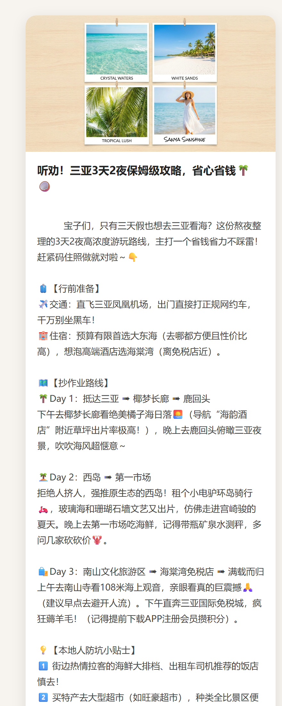

# 小红书智能体 Demo

输入主题 → 自动生成小红书笔记**文案 + 配图**，输出成可视化卡片。

## 效果预览



## 能力

- **文案**：根据主题和风格（种草 / 测评 / 教程 / 攻略 / 情绪向）生成标题、正文、话题标签
- **配图**：根据文案自动生成配套图片
- **可视化**：输出为小红书风格笔记卡片

## 技术栈

| 模块 | 当前模型 | 接口 |
|------|---------|------|
| 文案 | `gemini-3-pro-preview` | novaiapi 中转（OpenAI 兼容） |
| 配图 | `gemini-3-pro-image-preview` | 同上 |
| 界面 | Gradio | — |

> 模型背后是同一个接口，换 Claude / ChatGPT 只需改 `TEXT_MODEL` / `IMAGE_MODEL` 环境变量。

## 本地运行

```bash
pip install -r requirements.txt
# 复制 run.bat.example 为 run.bat，填入你的 NOVA_API_KEY，双击运行
```

或手动设置环境变量后 `python app.py`：

- `NOVA_BASE_URL`（默认 https://us.novaiapi.com/v1）
- `NOVA_API_KEY`（必填）
- `TEXT_MODEL` / `IMAGE_MODEL`

## 后续规划

- 部署到公网平台，拿到固定网址
- 接入飞书机器人（一个机器人 + 背后多模型路由）
